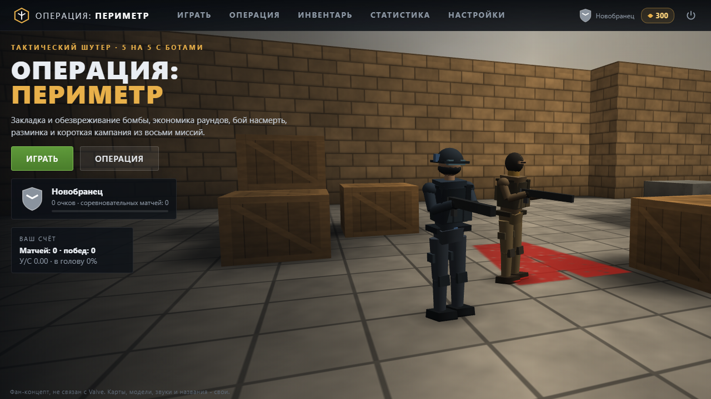
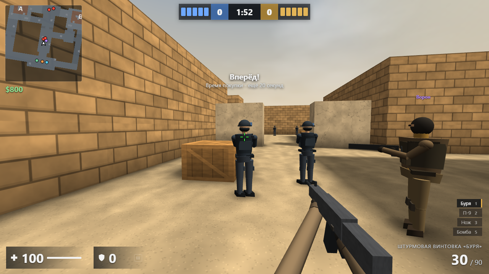
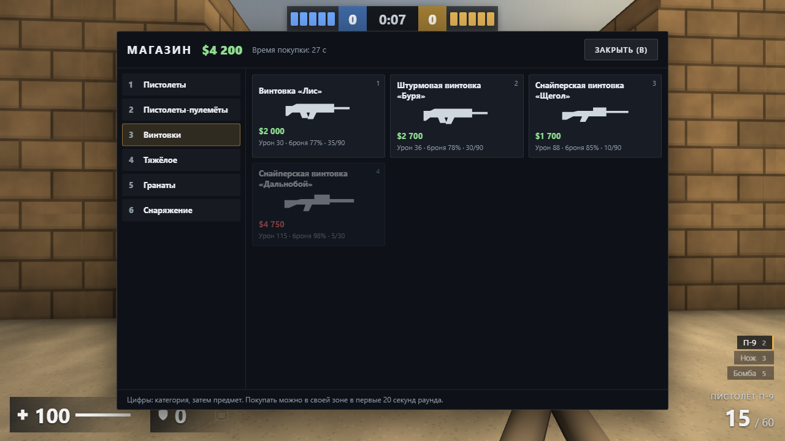

# Operation: Perimeter

**English** · [Русский](README.ru.md)

**Operation: Perimeter** («Операция: Периметр») is a tactical first-person shooter in the browser: 5 against 5 with bots, planting and defusing the bomb, a round economy, a warm-up and a short campaign of missions. It runs in the browser with no server and no internet: open `index.html` or play it online.

**[▶ Play online](https://alexalesha.github.io/OperationPerimeter/)**

> Fan-made game. Not affiliated with or endorsed by Valve. Maps, models, weapons and names are original and made by code.

The interface is in Russian.







## What is in the game

- **Modes:** bomb defusal 5v5 with bots, deathmatch, a warm-up and a short campaign of missions.
- Round economy: money for kills, wins and losses, a loss streak bonus; a buy menu with pistols, SMGs, rifles, sniper rifles, heavy weapons, grenades and gear.
- Weapons with their own spread, recoil patterns and armour penetration; bots that take positions, plant and defuse.
- A profile with statistics and ranks, an inventory, settings with key rebinding; three.js r149 in `vendor/` (MIT).

## Controls

| Key | Action |
|---|---|
| W A S D | move |
| Space | jump |
| Ctrl | crouch |
| Shift | walk quietly |
| R | reload |
| E | use (defuse, pick up) |
| B | buy menu |
| Tab | scoreboard |
| Mouse | aim and fire |

Keys can be changed in the settings where the game offers it; a gamepad works too where noted above.

## Run locally

Open `index.html` in Chrome, Edge or Firefox. Everything is in the repository; nothing is downloaded.

## Tests

The laws are Playwright tests in `tests/`. They open the page by its file address in headless
Chromium, one at a time:

```
npm install
npx playwright install chromium
npm test
```

Mouse capture in the tests is always a stub (a real `requestPointerLock` in headless Chromium on
Windows can clip the user's cursor).
The pictures above were made headless by the screenshot script of the GameRoom collection.

## History

The game was made in the [GameRoom](https://github.com/ALEXalesha/GameRoom) collection (folder `web/fps_1`), where it also runs in the Igroteka launcher ([play there](https://alexalesha.github.io/GameRoom/)). This repository carries the game with its commit history.

## Licence

MIT, see [LICENSE](LICENSE). three.js: MIT.
